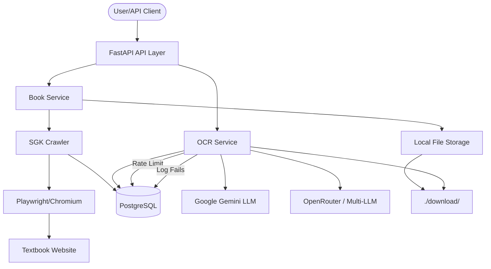

# AGENTS.md

This file provides a comprehensive overview of the `crawler-sgk` project, optimized for AI agents.

## 🚀 Build and Development Commands

This project uses `uv` for lightning-fast dependency management.

| Task | Command |
| :--- | :--- |
| **Sync Dependencies** | `uv sync` |
| **Dev Server** | `uv run dev` |
| **Run Tests** | `uv run test` |
| **Crawl Script** | `uv run crawl` |
| **Docker Build** | `docker build -t crawler-sgk .` |
| **Docker Compose** | `docker-compose up -d` |
| **OCR Test Script** | `uv run python scripts/test_ocr.py` |

## 🏗️ Architecture & Structure

The project follows a Domain-Driven Design (DDD) inspired structure.

```text
app/
├── api/v1/             # FastAPI routers and versioned endpoints
│   └── endpoints/      # Resource-specific logic (books.py, ocr.py)
├── core/               # Configuration (Pydantic Settings)
├── dependencies/       # DI components (DB session, etc.)
├── domains/            # Pure business logic and services
│   └── books/          # Playwright-based crawler and OCR Service
└── infrastructure/      # Persistence layer (SQLAlchemy models/DB init)
```

## 💾 Database Schema (PostgreSQL)

Managed via SQLAlchemy ORM. Default port: `6432`.

### `books` Table
- `id`: PK (Integer)
- `title`: String (Index)
- `url`: String (Unique, Index)
- `total_pages`: Integer
- `created_at`: DateTime

### `book_pages` Table
- `id`: PK (Integer)
- `book_id`: FK -> `books.id`
- `page_number`: Integer
- `image_url`: Text (Source URL)
- `image_path`: String (Local path in `./download/`)
- `process_markdown_id`: FK -> `process_markdown.id` (Nullable)
- `created_at`: DateTime

### `process_markdown` Table
- `id`: PK (Integer)
- `image_name`: String (Unique, Index)
- `result_markdown`: Text (OCR Output)
- `status`: String (pending, completed, failed)
- `created_at`: DateTime

### `ocr_fail` Table
- `id`: PK (Integer)
- `image_name`: String (Index)
- `error_message`: Text
- `created_at`: DateTime

### `ocr_rate_limit` Table
- `id`: PK (Integer)
- `current_count`: Integer
- `window_start`: DateTime

### `config` Table (Encrypted)
- `id`: PK (Integer)
- `key`: String (Index)
- `value`: Text (3DES Encrypted)
- `active`: Integer (0/1)
- `created_at`: DateTime
- `updated_at`: DateTime

## 🛠️ Code Style & Conventions

- **Python Version**: 3.13+ (Strictly enforced)
- **Async/Await**: Mandatory for all DB operations (`asyncpg`), Crawling (`playwright`), and LLM calls.
- **Type Hinting**: Required for all function signatures and complex variables.
- **Dependency Injection**: Use FastAPI `Depends` for services and DB sessions.
- **Error Handling**: 
  - Raise custom exceptions in `domains`.
  - Handle exceptions in `api` layer or via global middleware.
- **Naming**: 
  - `snake_case` for variables/functions.
  - `PascalCase` for classes/models.

## 📊 Architecture Workflow Diagram



## 🔌 Internal APIs

- `POST /api/v1/books/crawl`: Initiates a background crawl for a given URL.
- `POST /api/v1/ocr/process/{image_name}`: Converts a downloaded image to high-fidelity Markdown using LLM. Supports optional `provider` and `model` query parameters.
- `POST /api/v1/ocr/process-all`: Bulk processes all images in the `download/` folder with rate limiting (15/min). Supports optional `provider` and `model`.
- `GET /api/v1/health`: Returns API and Database health status.
- `GET /docs`: Interactive Swagger UI documentation.
