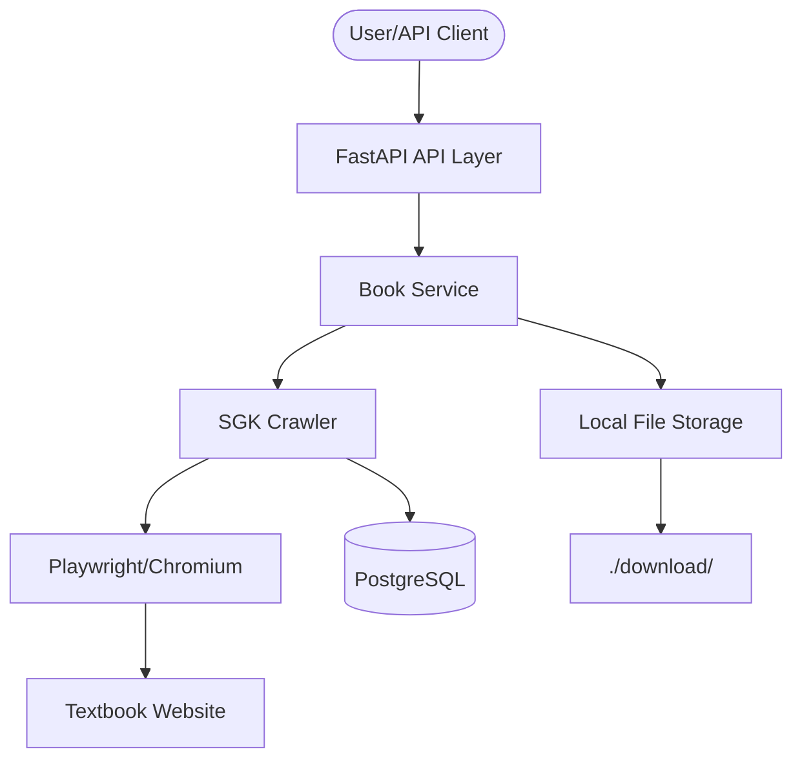

# AGENTS.md

This file provides a comprehensive overview of the `crawler-sgk` project, optimized for AI agents.

## 🚀 Build and Development Commands

This project uses `uv` for lightning-fast dependency management.

| Task | Command |
| :--- | :--- |
| **Sync Dependencies** | `uv sync` |
| **Dev Server** | `uv run uvicorn app.main:app --reload` |
| **Run Tests** | `uv run pytest` |
| **Docker Build** | `docker build -t crawler-sgk .` |
| **Docker Compose** | `docker-compose up -d` |

## 🏗️ Architecture & Structure

The project follows a Domain-Driven Design (DDD) inspired structure.

```text
app/
├── api/v1/             # FastAPI routers and versioned endpoints
│   └── endpoints/      # Resource-specific logic (e.g., books.py)
├── core/               # Configuration (Pydantic Settings)
├── dependencies/       # DI components (DB session, etc.)
├── domains/            # Pure business logic and services
│   └── books/          # Playwright-based crawler and processing
└── infrastructure/      # Persistence layer (SQLAlchemy models/DB init)
```

## 💾 Database Schema (PostgreSQL)

Managed via SQLAlchemy ORM. Default port: `6432`.

### `books` Table
- `id`: PK (Integer)
- `title`: String (Index)
- `url`: String (Unique, Index)
- `total_pages`: Integer
- `created_at`: DateTime

### `book_pages` Table
- `id`: PK (Integer)
- `book_id`: FK -> `books.id`
- `page_number`: Integer
- `image_url`: Text (Source URL)
- `image_path`: String (Local path in `./download/`)
- `created_at`: DateTime

## 🛠️ Code Style & Conventions

- **Python Version**: 3.13+ (Strictly enforced)
- **Async/Await**: Mandatory for all DB operations (`asyncpg`) and Crawling (`playwright`).
- **Type Hinting**: Required for all function signatures and complex variables.
- **Dependency Injection**: Use FastAPI `Depends` for services and DB sessions.
- **Error Handling**: 
  - Raise custom exceptions in `domains`.
  - Handle exceptions in `api` layer or via global middleware.
- **Naming**: 
  - `snake_case` for variables/functions.
  - `PascalCase` for classes/models.

## 📊 Architecture Workflow Diagram



## 🔌 Internal APIs

- `POST /api/v1/books/crawl`: Initiates a background crawl for a given URL.
- `GET /api/v1/health`: Returns API and Database health status.
- `GET /docs`: Interactive Swagger UI documentation.
