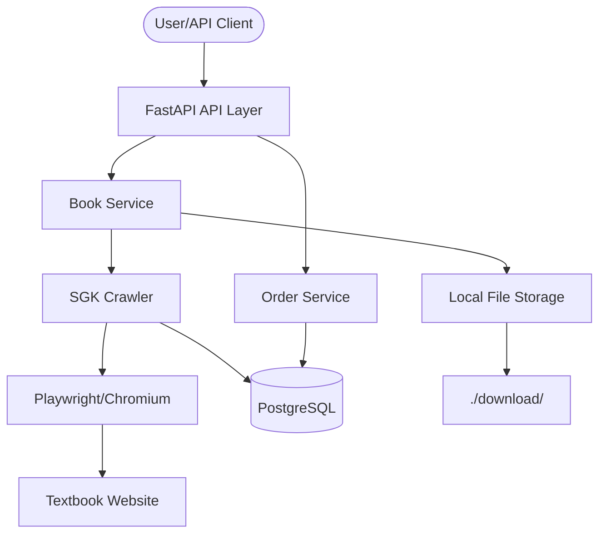

# AGENTS.md

This file provides an overview of the `crawler-sgk` project for AI agents.

## Build and Development Commands

This project uses `uv` for dependency management.

- **Sync Dependencies**: `uv sync`
- **Run Development Server**: `uv run uvicorn app.main:app --reload`
- **Run Tests**: `uv run pytest`
- **Docker Build**: `docker build -t crawler-sgk .`
- **Docker Compose**: `docker-compose up -d`

## Architecture & Structure

The project follows a domain-driven structure:

- `app/`: Root application directory.
  - `api/v1/`: FastAPI routers and endpoints.
    - `endpoints/books.py`: Crawler initiation and book management.
    - `endpoints/orders.py`: Order management logic.
  - `core/`: Core configuration, settings, and constants.
  - `dependencies/`: FastAPI dependency injection components (e.g., DB session).
  - `domains/`: Business logic and domain services.
    - `books/`: Logic for book processing and crawling using Playwright.
    - `orders/`: Schemas and services for order management.
  - `infrastructure/`: Database models (SQLAlchemy), persistence logic, and DB initialization.
- `download/`: Local directory for storing downloaded textbook images.
- `tests/`: Project test suite using `pytest`.

## Database Schema (PostgreSQL)

The database is managed using SQLAlchemy ORM.

### `books` Table
- `id`: Primary Key (Integer)
- `title`: Book title (String)
- `url`: Source URL (String, Unique)
- `total_pages`: Total number of pages (Integer)
- `created_at`: Timestamp (DateTime)

### `book_pages` Table
- `id`: Primary Key (Integer)
- `book_id`: Foreign Key to `books.id`
- `page_number`: Sequence number of the page (Integer)
- `image_url`: Original image source URL (Text)
- `image_path`: Local path to the downloaded image (String)
- `created_at`: Timestamp (DateTime)

## Code Style & Conventions

- **Python Version**: 3.13+
- **Async/Await**: Used consistently for database operations (`asyncpg`) and crawling (`playwright`).
- **Type Hinting**: Required for all function signatures and complex variables.
- **Dependency Injection**: Use FastAPI's `Depends` for services and database sessions.
- **Error Handling**: Use custom exceptions in domain layers and handle them in API middleware or routers.

## Architecture Workflow Diagram

## Internal APIs

- `POST /api/v1/books/crawl`: Initiates a crawl for a given URL (runs in background).
- `GET /api/v1/orders/`: List orders.
- `POST /api/v1/orders/`: Create an order.
- `GET /api/v1/health`: Health check endpoint.
